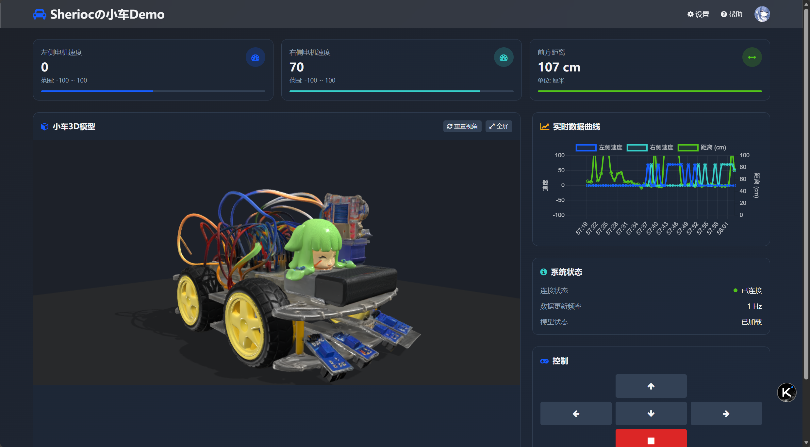
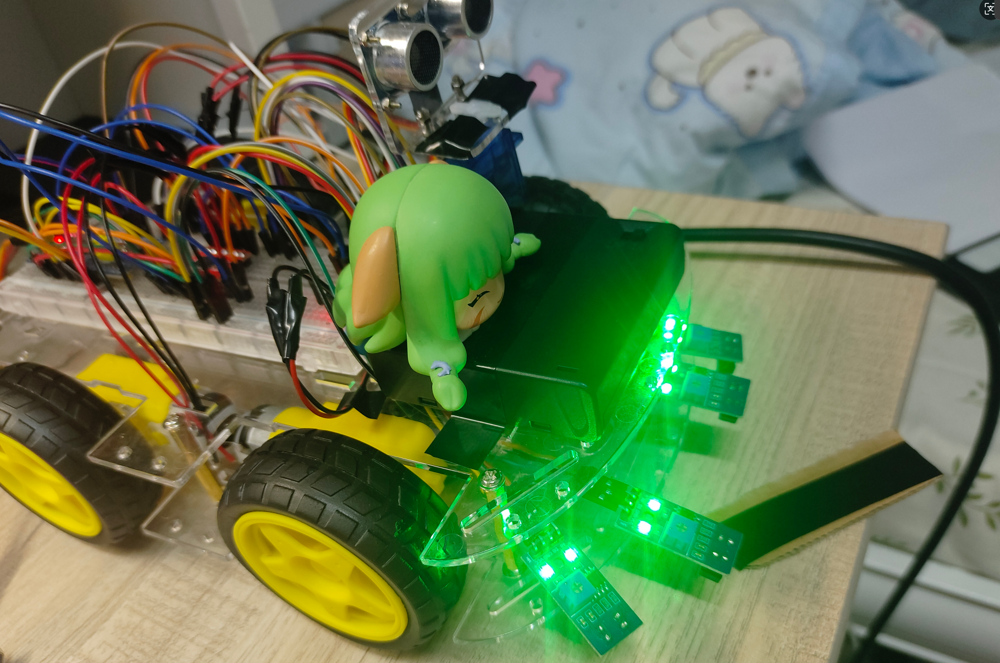
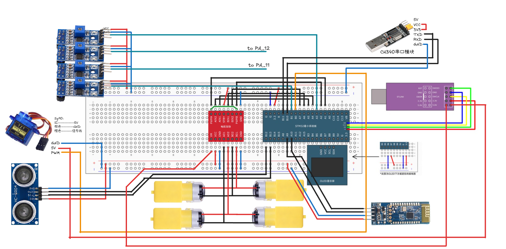

# STM32_Car-基于STM32的智能小车与可视化Demo







## 项目架构

STM32_Car
│  README.md
│  stm32引脚定义图.png
│  接线图.excalidraw            // 接线图，可用vscode excalidraw 插件打开，或者[handraw.top](https://handraw.top)在线查看
│
├─STM                           // 整个 MCU 工程根目录
│  │
│  ├─Application               // **业务逻辑层**
│  │      Messager.c/h          	   // 统一消息分发，串口协议解包/打包
│  │      ObstacleAvoid.c/h     // 超声避障
│  │      TrackLine.c/h             // 红外循线
│  │
│  ├─Hardware                  // **驱动层**
│  │      Car.c/h             		  	// 小车整体接口：前进/后退/停止
│  │      Infrared.c/h         		// 4 路TRCT5000红外模块
│  │      Motor.c/h            	 	// TB6612 电机去驱动
│  │      PWM_Motor.c/h         	// 电机 PWM 占空比（速度）输出
│  │      PWM_Servo.c/h         	// 舵机 PWM 占空比（角度）输出
│  │      Serial.c/h           	 	// CH340串口
│  │      Serial_HC05.c/h       	// 蓝牙 HC-06
│  │      Servo.c/h           	 	 // 舵机
│  │      Ultrasound.c/h       		 // HC-SR04 超声测距（us→cm）
│  │
│  ├─Library                 // **CMSIS + 标准外设库**（只读）
│  │      ...                  		 	// stm32f10x_xxx.c / core_cm3.c 等
│  │
│  ├─Start                     // **启动文件 + 系统时钟**
│  │      startup_stm32f10x_hd.s
│  │      system_stm32f10x.c
│  │
│  ├─System                    // **纯软件工具**
│  │      Delay.c/h             	// 阻塞式微秒/毫秒延时
│  │      Timer.c/h             	// 通用定时器中断回调框架
│  │
│  └─User                      // **用户入口**
│          main.c             		  // Main程序入口
│          stm32f10x_it.c       	// 中断向量入口（USART、TIM、EXTI）
│
└─web_model                // **网页端 3D 可视化**
    │  index.html              		 // 模型加载页
    │  server.py                		// 简易 WebSocket服务器（Python）
    ├─imgs
    │      sherioc.png          // 个人头像
    ├─js
    │      app.js                		// 与 MCU 蓝牙/串口通信 + 控制模型动作
    └─model
            sherioc_car.glb      	 // 小车 3D 模型（glTF 二进制）


## 项目运行

1、stm32代码下载到小车

2、 `python serve.py` 启动后端，打开 `http://localhost:8080/index.html`显示web页面

```python
NOTE:
- 确保CH340驱动在PC上安装
```


### Appendix

开发者&日志

```
bug:
【2025/10/15】
- 有概率出现：舵机转动一次后蓝牙断开
- 串口发送超声波测距，有时可能挂（一直发送相同数据，连带导致电机驱动无法正常工作）
```
